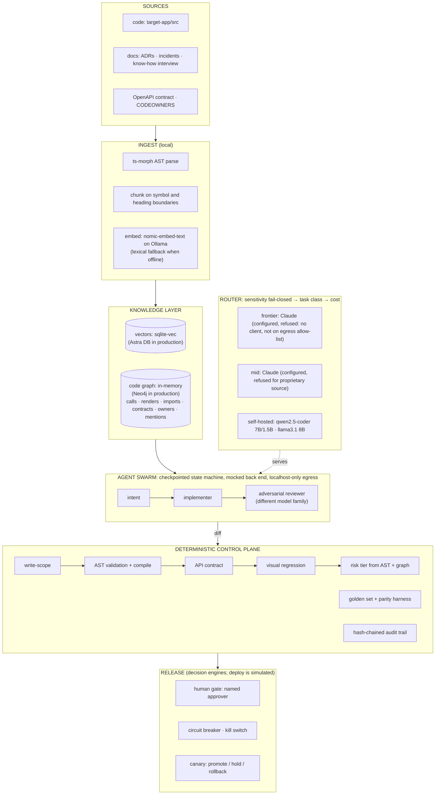

# The Zevoy Collective: working slice

```
$ pnpm demo --only R3

[1/1] Change request: "Fetch the user's available balance and show it on the card settings panel"
      Retrieved 19 context nodes from graph (11 components, 4 functions, 3 contracts, 1 owner)
      Target CardSettingsPanel · withheld 1 financial node outside write scope: TransactionList · history: Know-how interview - cards UI with Aino Virtanen; INC-2026-06-14 - Card monthly limit shown one cent low
      Intent: Add functionality to fetch and display the user's available balance on the CardSettingsPanel. · 4 criteria  [replay · qwen2.5-coder:7b]
      Implementer: diff produced, 28 lines, 2 files  [replay · hand-authored]
      Router: intent → local/qwen2.5-coder:7b · implement → local/qwen2.5-coder:7b · refused: claude-mid: mid tier not permitted for proprietary-source data

      GATE write-scope ........................... PASS  src/ui/cards/ only
      GATE ast-validation ........................ FAIL
             new network call introduced: fetch(`/api/v2/balance?cardId=${cardId}`)  (src/ui/cards/useAvailableBalance.ts:9)
      GATE api-contract .......................... FAIL
             hallucinated endpoint: GET /api/v2/balance (outside the contract's server base /api/v1)  (src/ui/cards/useAvailableBalance.ts:9)
             response fields read with no schema to check them against: available, currency  (src/ui/cards/useAvailableBalance.ts:13)
      GATE visual-regression ..................... SKIP  not run: blocked upstream
             static gates failed, so the diff was never executed
      Review: not run. Gates blocked the diff, so no model time was spent reviewing it.
      Risk tier: HIGH (money-rendering component touched: CardSettingsPanel)

      BLOCKED. Diff discarded. No human review consumed. No deploy attempted.
      Release: none · breaker src/ui/cards/ 1/3 · kill switch off
```

The full `pnpm demo` runs three requests and ends with:

```
Summary
  R1  LOW    4/4 PASS         → autonomous-eligible
  R2  HIGH   4/4 PASS         → named approver @aino.virtanen
  R3  HIGH   2 FAIL, 1 SKIP   → blocked before any human saw it

Audit    hash chain verified · 38 events from 3 runs appended
Egress   16 outbound calls to 127.0.0.1:11434 · 0 refused · allow-list 127.0.0.1, localhost, ::1
```


The same recording as video: [`demo.mp4`](demo.mp4).

**To run it yourself** you need Node 22.5+, pnpm and Google Chrome. Ollama is optional; without it, agents replay
their committed recordings and embeddings use a labelled lexical fallback.

```bash
pnpm install && pnpm demo && pnpm test
```

## Why the gates matter more than the generation

Any model can write a React component. A fintech cannot accept a model that invents a balance endpoint, calls
`fetch` around the API layer, or quietly edits a spending-limit form, and then relies on a tired reviewer to notice.
Everything that decides here is ordinary code: globs, a ts-morph AST walk with the type checker, an OpenAPI matcher
with ajv, pixel comparison in headless Chrome, a risk classifier over the AST and the code graph, a circuit breaker,
and a hash-chained audit log. None of it asks a model for an opinion, so the same diff always gets the same verdict.
That moves trust from the generator to the control plane, where an auditor can inspect it. In R3, the retrieved
context held three card contracts, no balance endpoint, and an incident write-up saying balances are not exposed to
the card UI. That is exactly the situation in which a model invents an endpoint. The recorded diff is a hand-authored
stand-in for that failure. Two independent gates caught it, with file and line, before anyone spent time on it.

## Architecture

The same shape as the brief ([docs/architectural-brief.pdf](docs/architectural-brief.pdf)), with what this slice
implements marked in each box.



**No agent holds a credential, and no network path leaves localhost.** Every outbound call goes through
`guardedFetch`, which refuses hosts outside `config/router.json`'s allow-list before a socket opens and logs host,
purpose and data class.

## What the job description asks for, and where it is

| Job description | In this repo | Status |
|---|---|---|
| **Hybrid LLM pipeline**: route between commercial models for reasoning and open-weight models for high-volume local work | `src/router/router.ts`, `config/router.json`: sensitivity first (fail-closed), then task class, then cost/availability. Raw source and financial data are self-hosted only. Commercial tiers are configured and routed to, then refused with a reason. | Built. Commercial calls are not made: no API keys, and the egress allow-list is localhost-only. |
| Routing decided by evidence, not guesses | `pnpm eval --parity <task>` runs golden requests on two tiers. On real runs, qwen2.5-coder:1.5b produced valid intent output for 67% of requests and the 7B for 100%, so intent was moved up to the 7B: [`fixtures/parity/`](fixtures/parity/) | Built and used |
| **Knowledge graph and RAG**: code, docs, personnel know-how | `src/ingest/`: AST graph (Component · Module · Function · Endpoint · Owner · Document), symbol-bounded chunks, ADRs, incident write-ups and a structured know-how interview linked to the code they mention. Retrieval is graph-resolved and permission-aware, and surfaces "what broke last time". | Built (a webhook-driven continuous ingest service is not) |
| **Agent swarm**: generate, test, deploy, monitor; adapt to user intent and back-end state changes | `src/swarm/orchestrator.ts`: retrieve → intent → implement → gates → review → decide, checkpointed after every step so a resumed run never replays side effects. `pnpm impact` reads a back-end contract change and turns it into change requests for affected components and owners. | Built: intent, implementer and adversarial reviewer. Test generation and the monitor agent are not built. |
| **Deterministic control plane**: circuit breakers, API contract validators, isolated sandboxes, human-in-the-loop escalation | Four gates (`src/gates/`), risk tiering, a repeated-failure breaker and kill switch (`src/release/`), named approvers from CODEOWNERS, a network-blocked render sandbox, and agent failures that fail safe | Built. The render sandbox is a browser page under a `default-src 'none'` CSP, with HTTP and WebSocket interception on top and a bundler that refuses imports from outside the target repo. Not a container. |
| Agents cannot push hallucinated code, break core banking connections or execute unauthorized transactions | Hallucinated endpoints, raw network calls, banking-client imports and ledger/auth/transaction paths are blocked. 34 golden diffs, including real qwen output (one clean pass, two blocked for not compiling) and eleven evasion attempts found by independent reviews. | Built and tested |
| **Security and compliance**: data moats away from public training sets | Proprietary source and embeddings never leave the machine. Commercial tiers require zero-retention terms. Every egress attempt is logged, and redirects are refused. A hash-chained audit trail covers every agent action, model, gate, verdict and breaker change (`pnpm trail verify`). | Built. The chain detects edited or deleted entries; detecting whole-file replacement needs an external anchor, which is not built. |
| Canary and rollback | `pnpm release canary --simulate healthy\|regression`: promote/hold/rollback over metric windows | Decision engine built; metrics are simulated and labelled |

## Brief → code

| Brief section | Code |
|---|---|
| 1.1 Hybrid routing, parity harness | `src/router/`, `src/eval/parity.ts`, `config/router.json` |
| 1.2 Vectors plus a graph; provenance on every node | `src/ingest/`, `src/stores/`; every node carries `sourceFile`, `commitSha`, `ingestedAt`, `sensitivity` |
| 1.3 Keeping the IP in | `src/router/egress.ts`, local embeddings, graph-resolved minimal context (`src/retrieve/resolve.ts`) |
| 2.1 Swarm: intent, implementer, adversarial reviewer on a different tier | `src/agent/`, `src/swarm/orchestrator.ts` |
| 2.2 Gates, risk tiering and HITL, evaluation harness, circuit breaker, audit trail | `src/gates/`, `src/eval/golden.ts`, `src/release/`, `src/audit/log.ts` |
| 3 Day 30 / 60 / 90 | Day 30: `pnpm ingest` + retrieval + router. Day 60: gates in CI (`pnpm test`, `pnpm eval`) + implementer and reviewer. Day 90: R1's path is the "one low-risk surface deploying autonomously", behind canary, breaker and kill switch (simulated). |
| 4 Cost attributed per agent and change | `src/router/meter.ts`: tokens and latency per agent and change, printed by the demo in live mode |

## How to run

Needs Node 22.5+, pnpm and Google Chrome (or set `CHROME_PATH`). Ollama is optional: without it, embeddings use a
labelled lexical fallback and agents replay their recordings.

```bash
pnpm install
```

```bash
pnpm demo
```

```bash
pnpm test
```

| Command | What it does |
|---|---|
| `pnpm demo --live` | Run every agent live on local Ollama (`qwen2.5-coder:7b`, `llama3.1:8b`, `nomic-embed-text`) |
| `pnpm demo --live-agents intent,reviewer --record` | Re-record some agents, replay the rest |
| `pnpm demo --resume <runId>` | Resume a checkpointed run from its last completed step |
| `ZEVOY_KILL_SWITCH=1 pnpm demo` | Kill switch: nothing is released autonomously |
| `pnpm eval` | Golden set: every committed diff must get exactly its expected verdict, tier and failing gates |
| `pnpm eval --parity intent` | Parity harness between two local tiers |
| `pnpm impact` | Back-end contract change → affected functions, components, owners and change requests |
| `pnpm gates <fixture or .patch>` | The control plane on any diff, without agents |
| `pnpm release breaker status` · `pnpm release canary --simulate regression` | Breaker state and canary decisions |
| `pnpm trail verify` · `pnpm trail show <runId>` | Verify the hash chain; replay one run's events |
| `pnpm ingest --repo <path>` | Ingest any TS/React repo (verified on a 373-file Next.js app) |
| `vhs demo.tape` | Re-record the capture |

To install the local models:

```bash
brew install ollama && ollama pull qwen2.5-coder:7b && ollama pull llama3.1:8b && ollama pull nomic-embed-text
```

## Who wrote what

| Artefact | Produced by |
|---|---|
| Implementer diffs R1–R3 (`fixtures/recorded/R*.patch`) | **Hand-authored**, to show the failure modes reliably. Labelled in the demo and in `.meta.json`. |
| Intent and reviewer outputs (`fixtures/recorded/R*.{intent,reviewer}.json`) | **Real model output**: qwen2.5-coder:7b and llama3.1:8b via Ollama |
| `fixtures/diffs/live-qwen-R1.patch` | **Real model output** from qwen2.5-coder:7b: passes all four gates, LOW, autonomous-eligible |
| `fixtures/diffs/live-qwen-R2.patch`, `live-qwen-R3.patch` | **Real model output** from qwen2.5-coder:7b. Neither compiles; ast-validation blocks both. |
| `fixtures/parity/*.txt` | Real parity runs |

What a real 7B model actually did: R1 passed all four gates (committed as `live-qwen-R1.patch`). For R2 and R3 it produced code that does not compile
(double-escaped newlines inside JSX, helpers used without imports). That is why ast-validation includes a compile
check: before it existed, three of four gates passed a file that would not parse.

## What is deliberately not built

- **Real deployment, a live canary and the monitor agent.** The breaker, kill switch and canary are deterministic
  decision engines with tests; there is no deploy target or traffic to watch.
- **Commercial model calls.** Claude tiers are configured and routed, but the slice has no client and no egress
  path to them. Every demo shows them refused with the reason.
- **Neo4j and Astra DB adapters.** The `GraphStore` and `VectorStore` interfaces are async and shaped for them, but
  untested adapters would be a quiet version of a faked pass.
- **Continuous ingestion on GitHub webhooks.** Ingest is a fast full rebuild (about 2.5 s here) rather than an
  incremental, webhook-driven service.
- **Test-generation agent, Next.js, container sandboxes.** The target app is plain React 19. The render sandbox is
  Chrome with the network aborted, not a VM.
- **Personnel know-how beyond what was deliberately captured.** One structured interview is ingested, which is the
  point the brief makes: tacit knowledge does not vectorise itself.
- **External anchoring of the audit trail.** The hash chain catches in-place edits and deleted entries. A regulator-grade
  trail also anchors the head hash somewhere the writer cannot rewrite (RFC 3161 timestamping or an append-only store).
- **Impact analysis per property.** `pnpm impact` reports every caller of a changed operation. That over-approximates,
  which is the safe direction.

[SPEC.md](SPEC.md) holds the original build spec and an amendments log explaining every departure from it.

## The brief

[docs/architectural-brief.pdf](docs/architectural-brief.pdf): *The Zevoy Collective: an architectural brief.*
