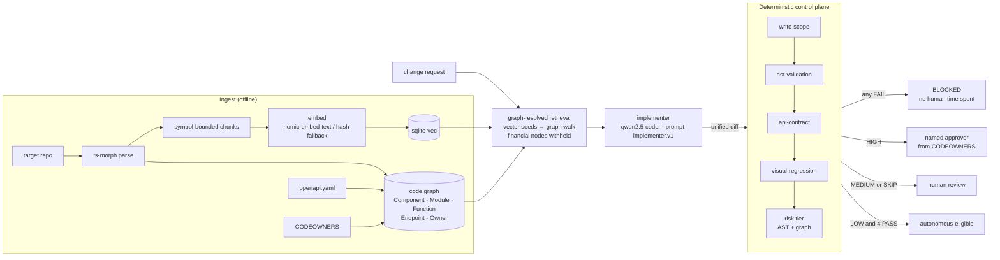

# The Zevoy Collective: working slice

```
$ pnpm demo --only R3

[1/1] Change request: "Fetch the user's available balance and show it on the card settings panel"
      Retrieved 19 context nodes from graph (11 components, 4 functions, 3 contracts, 1 owner)
      Target CardSettingsPanel · withheld 1 financial node outside write scope: TransactionList
      Implementer: diff produced, 28 lines, 2 files  [replay · hand-authored · implementer.v1]

      GATE write-scope ........................... PASS  src/ui/cards/ only
      GATE ast-validation ........................ FAIL
             new network call introduced: fetch(`/api/v2/balance?cardId=${cardId}`)  (src/ui/cards/useAvailableBalance.ts:9)
      GATE api-contract .......................... FAIL
             hallucinated endpoint: GET /api/v2/balance (outside the contract's server base /api/v1)  (src/ui/cards/useAvailableBalance.ts:9)
             response fields read with no schema to check them against: available, currency  (src/ui/cards/useAvailableBalance.ts:13)
      GATE visual-regression ..................... SKIP  not run: blocked upstream
             static gates failed, so the diff was never executed
      Risk tier: HIGH (money-rendering component touched: CardSettingsPanel)

      BLOCKED. Diff discarded. No human review consumed. No deploy attempted.
```

The full `pnpm demo` runs three requests and ends with:

```
Summary
  R1  LOW    4/4 PASS         → autonomous-eligible
  R2  HIGH   4/4 PASS         → named approver @aino.virtanen
  R3  HIGH   2 FAIL, 1 SKIP   → blocked before any human saw it
```

## Why the gates matter more than the generation

Any model can write a React component. What a fintech cannot accept is a model that invents a balance endpoint,
calls `fetch` around the API layer, or quietly edits a spending-limit form, and then depends on a tired reviewer to
notice. Everything that decides here is ordinary code: globs, a ts-morph AST walk, an OpenAPI matcher with ajv,
pixel comparison in headless Chrome, and a risk classifier that reads the AST and the code graph. None of it asks a
model for an opinion, so the same diff always gets the same verdict. That shifts the system's trust from the
generator to the control plane, which is where an auditor can inspect it. In R3, the retrieved context contained
three card contracts and no balance endpoint, which is exactly the situation in which a model invents one. The recorded
diff is a hand-authored stand-in for that failure. Two independent gates caught it, with file and line, before any
person spent time on it. That is the claim this repo exists to prove.

## Architecture

> Placeholder: replace with the diagram from the brief.



| Gate | What it proves | How |
|---|---|---|
| write-scope | The diff only touches `src/ui/**`; never ledger, transactions, auth, generated code, harness fixtures or tests | picomatch globs; deny beats allow; paths that escape the repo are never read |
| ast-validation | The post-diff code compiles, and the diff introduces no raw network call, undeclared dependency, eval, computed import, `dangerouslySetInnerHTML`, suppression, direct banking-client import or env read | ts-morph walk of pre- and post-diff files; callees resolved through the type checker, so `window["fetch"]`, `self.fetch` and `const f = fetch` are caught; only what the diff *introduces* counts |
| api-contract | Every HTTP call hits a real path with an allowed method, a schema-valid body, and only reads declared response fields | Calls through `src/api/*` wrappers are resolved with the type checker; body types are compared to the schema; literal bodies are validated with ajv |
| visual-regression | Elements the diff kept look identical; the harness still matches its committed baseline | esbuild bundles each affected fixture with the diff overlaid in memory; headless Chrome with all network aborted; pixelmatch per element |
| risk tier | LOW / MEDIUM / HIGH with reasons and named approvers | Money-rendering components, submit forms, amount fields, permission checks, financial endpoints, state shape, and a logic fingerprint that ignores copy and styling |

The graph carries `sourceFile`, `commitSha`, `ingestedAt` and `sensitivity` on every node. Retrieval uses sensitivity
to withhold financial code outside the write scope (`TransactionList` above); the classifier uses it to escalate.

## How to run

Needs Node 22.5+, pnpm and Google Chrome (for the visual gate; or set `CHROME_PATH`).

```bash
pnpm install
```

```bash
pnpm demo
```

```bash
pnpm test
```

Other entry points:

| Command | What it does |
|---|---|
| `pnpm demo --only R3` | One request |
| `pnpm demo --pace 120` | 120 ms between lines, for a screen recording |
| `pnpm gates <fixture or .patch>` | Run the control plane on any diff without the agent, e.g. `pnpm gates contract-wrong-method` |
| `pnpm ingest --repo <path>` | Ingest any TS/React repo and print graph counts |
| `pnpm baseline` | Re-render committed visual baselines (only after a human has reviewed the change) |
| `pnpm fixtures` | Regenerate every fixture diff from asserted search/replace edits |

**Live generation.** By default the demo replays the diffs in `fixtures/recorded/`. Those diffs were **written by
hand** to stand in for model output, and their `.meta.json` and the demo output both say so. To run the real agent:

```bash
brew install ollama
```

```bash
ollama pull qwen2.5-coder:7b && ollama pull nomic-embed-text
```

```bash
pnpm demo --live --record
```

With Ollama up, the embedder switches from the lexical fallback to `nomic-embed-text` automatically. Live output
varies run to run; the gates' verdict on any given diff does not.

**What a real 7B model actually did.** On the first live run, `qwen2.5-coder:7b` produced a clean R1 copy change
(four PASSes, LOW). For R2 and R3 it produced code that does not compile: double-escaped newlines inside JSX, and
`formatMoney` and `toMinorUnits` used without imports. ast-validation blocks both with exact lines. Those diffs are
committed as `fixtures/diffs/live-qwen-R2.patch` and `live-qwen-R3.patch`, the only fixtures that are genuine model
output. They are why the compile check exists: before it, three of four gates passed a file that would not parse.

**Recording.** `vhs demo.tape` writes `demo.mp4` and `demo.gif` (about 84 s, ending on the summary).

## What is deliberately not built

- **A multi-agent swarm.** One implementer only. The brief argues the roles; this slice proves the gates.
- **Deployment, canary and circuit breaker.** "Eligible for autonomous deploy" is a verdict; nothing is deployed.
- **Personnel know-how ingestion.** Owners come from CODEOWNERS only.
- **Neo4j and Astra DB.** `GraphStore` and `VectorStore` are async interfaces shaped for them (the comments sketch
  the Cypher and `$vector` mappings), but only the in-memory graph and `sqlite-vec` are implemented. Untested adapters
  would be a quiet version of a faked pass.
- **A live-model recording.** Ollama was not available on the build machine. Until `--live --record` is run, every
  demo diff is a labelled, hand-authored stand-in.
- **Semantic retrieval offline.** The fallback embedder is lexical feature hashing. It is good enough to find
  `CardSettingsPanel` for these requests, and it is labelled whenever it runs.
- **Visual coverage beyond fixtures.** Only components with a `*.fixture.tsx` harness are rendered. A changed
  component without one makes the gate SKIP (human review), never PASS.

Every gate has failing-case tests on committed fixture diffs (`tests/`, `fixtures/diffs/`), including the bypasses
an independent review found (bracket access, aliasing, `self.fetch`, computed imports). [SPEC.md](SPEC.md) holds
the original spec and an amendments log explaining each departure from it.

## The brief

> Placeholder: link to the full architectural brief.
